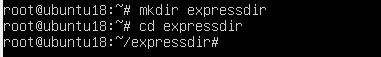

# CIT352-Final-Project
# TUTORIAL FOR INSTALLING POSTGRESQL, NODEJS AND EXPRESS ON UBUNTU 18

# INSTALLING POSTGRESQL ON UBUNTU 18
1.	Log into you ubuntu 18 as root and enter password

2.	After you have logged in as root, at the command prompt type the following command
apt-get install postgresql and press enter.

3.	Allow the software to be successfully installed.
4.	Check to see if it has been successfully installed by typing the following command at the command prompt apt list - -installed | grep postgres and press enter.

# HOW TO ALLOW POSTGRESQL TO ALWAYS START ON BOOT OF THE OS.
1.	At the command prompt type the following command systemctl enable postgresql and press enter.

2.  To confirm step 1, at the command prompt type systemctl is-enabled postgresql and press enter. (The command output should display enabled.)

# INSTALLING NODEJS ON UBUNTU 18
1.	As the root user type the following command apt install nodejs and press enter.

3.	Do you want to continue prompt will be displayed type y and press enter.
4.	Allow nodejs installation to continue until successfully installed.

5.	Check to see if it has been successfully installed by typing the following command at the command prompt apt list - -installed | grep nodejs and press enter.

6.	If you would like to see the version of nodejs that is installed. At the command prompt type node -v and press enter.

# HOW TO ALLOW NODEJS TO ALWAYS START ON BOOT OF THE OS

# INSTALLING EXPRESS ON UBUNTU 18

1. Ensure nodejs is installed before doing these steps.
2. Create a directory to contain your application and then change into the created directory

3. Install npm by typing the command apt install npm.
4. Type the command npm init to create a package.json file.
5. Install express by typing the command npm install express

